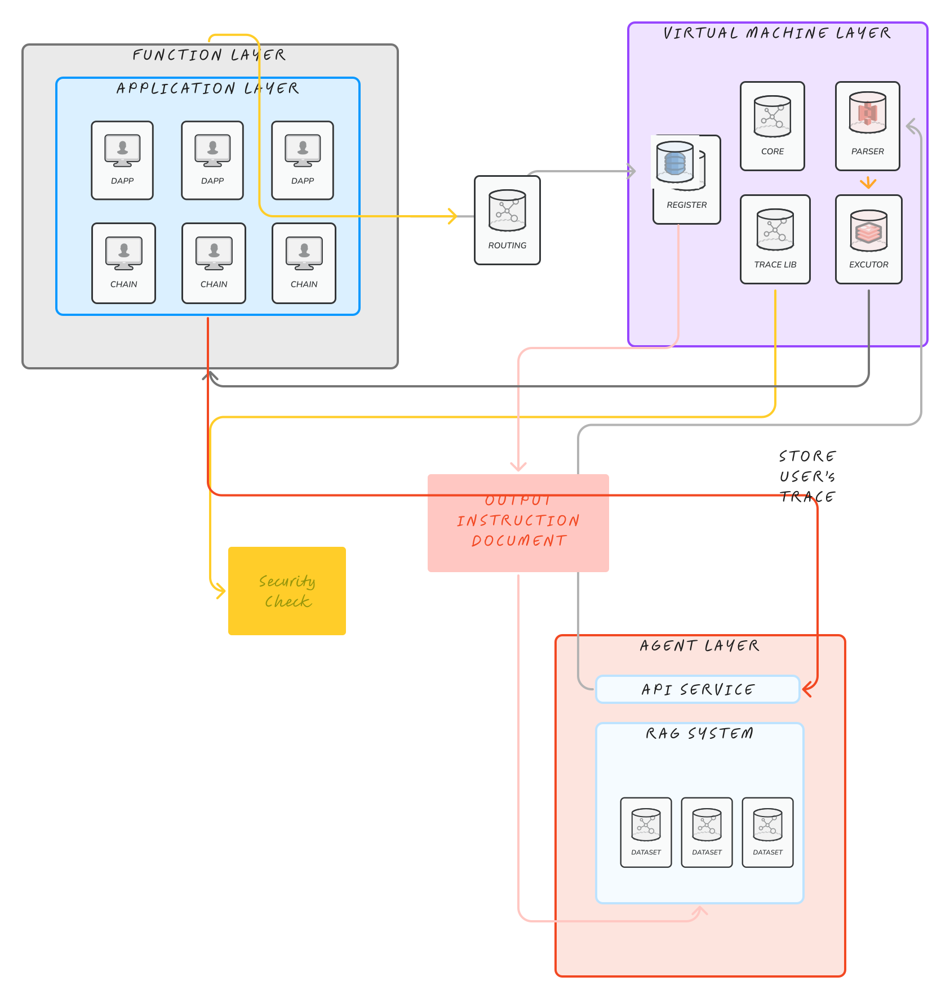
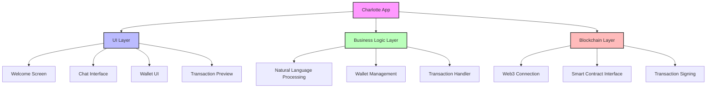
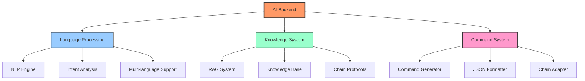
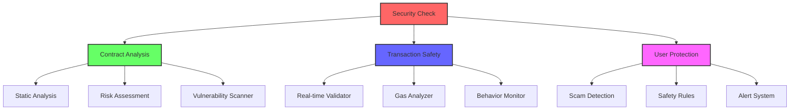
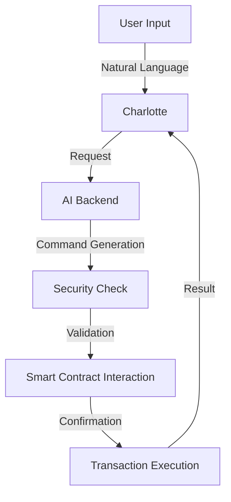

# EAM (Ethereum Agent Manager)

## Something about us

When I was young, I always dreamed to become a super hero that can change the world. And now, AI is the biggesr hero in the world.So we build Ethereum Agent Manager named EAM.We want to bring 10M Web2 users to Ethereum by simplifying interactions and enhancing security checks.We think it's not only a dream, it's a reality that can change the world.

## Overview

EAM is an innovative AI-powered middleware layer built between Ethereum and users, designed to revolutionize Web3 adoption. By leveraging advanced AI language capabilities, EAM aims to onboard the next 10M users into the Web3 ecosystem by making Ethereum interactions intuitive and secure.

## Quick Start

### Build Your Self

```bash
cd charlotte
flutter pub get
flutter run
```

### Get App

[Web Page](https://happyfox001.github.io/EAM)

⚠️ App still not working,waiting for interface alignment

**EAM consists of three main components:**

- Charlotte: Frontend Application built with Flutter for cross-platform compatibility, intuitive user interface, and natural language interactions.

- AI Backend: Developed with Python language, optimized for performance and security, and integrated with Charlotte.

- Security Check Model: Designed to check the security of user transactions and contracts, ensuring that users are protected from common Web3 vulnerabilities.

## Mission

Our mission is to bridge the gap between traditional users and Web3 technology by providing an intelligent, secure, and user-friendly interface that transforms natural language inputs into Ethereum operations.

## Architecture



EAM consists of three main components:

### 1. Charlotte



- Built with Flutter for cross-platform compatibility
- Intuitive user interface for natural language interactions
- Supports both text and voice inputs
- Real-time transaction preview and confirmation
- Wallet integration and management

### 2. AI Backend



- Advanced Natural Language Processing for understanding user intentions
- RAG (Retrieval-Augmented Generation) system for accurate command matching
- Smart command generation and optimization
- Standardized JSON output format for blockchain operations
- Multi-chain support and protocol adaptation

### 3. Security Check Model



- AI-powered smart contract risk assessment
- Real-time transaction analysis and validation
- Malicious contract detection
- Gas optimization recommendations
- User protection against common Web3 vulnerabilities

## Workflow



## Key Features

- **Natural Language Interface**: Interact with Ethereum using everyday language
- **Intelligent Command Generation**: Automatic conversion of user intentions into Ethereum operations
- **Security First**: Built-in security checks and risk assessment
- **Multi-Protocol Support**: Compatible with various DeFi protocols and Web3 applications
- **User-Friendly**: Simplified transaction flow with clear confirmations
- **AI-Powered Protection**: Advanced security measures to protect users from scams and errors

## Core Team Members

| Name       | Role | Background                                |
| ---------- | ---- | ----------------------------------------- |
| Qian Zhang | CEO  | Blockchain Engineer、Researcher in 6block |
| Junjie Shi | CTO  | AI engineer and blockchain expert         |

## Related Papers

1. **Realhybrid: A Hybrid Blockchain Consensus with Node-Level Switching**
   - *Authors*: Hao Yang, Jing Chen*, Chun Kit SZE, Meng Jia, Ruiying Du, Kun He
   - *Conference*: USENIX ATC
   - *Status*: Submitted

2. **Catching Large-Scale DeFi Security Threats via Graph-Transformer Language Mode**
   - *Authors*: Wei Ma, Chun Kit SZE (co-first author), Jiaxi Qiu, Cong Wu*, Jing Chen, Lingxiao Jiang, Shangqing Liu, Yang Liu, Xiang Yang
   - *Journal*: IEEE TIFS
   - *Status*: Submitted

## Related technologies

- 
- 
- 
- 
- 

## Future Development

- Multi-chain support expansion
- Advanced AI model iterations
- Enhanced security features
- Integration with more DeFi protocols(As Demo,we only have time to support Uniswap V3 and Lido)

## What we want to achieve

We want to make Ethereum more accessible to Web2 users by solving some of the key challenges in the current ecosystem, such as understanding user needs and ensuring security.We want to make Web3 become the future of the world.
