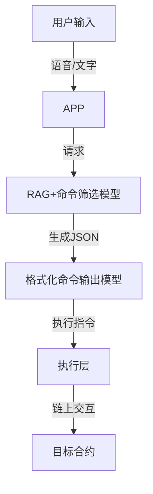

# EAM 产品文档

## 项目信息

EAM（Ethereum Agent Manager）是一个构建于以太坊和用户之间的通用 AI Agent 虚拟机层，旨在将用户需求转化为可一键授权的链上操作。该系统结合 AI、虚拟机与智能审计技术，降低 Web3 交互门槛，同时提升安全性。

### **核心特性**

- **智能指令生成**：结合 RAG（检索增强生成）技术，自动匹配不同 APP 的指令流。
- **链上智能执行**：解析用户意图并生成 JSON 格式的链上可执行命令。
- **安全审计 AI**：利用 AI 模型进行操作风险管理，防止恶意合约调用。
- **一键授权 & 执行**：用户授权后，可自动执行链上操作，减少复杂交互。

---

## 技术架构

EAM 主要由以下几个模块组成：

1. **APP 前端（Flutter）**

   - 负责处理用户输入（语音/文字）
   - 交互模型并展示指令执行选项

2. **RAG + 命令筛选模型**

   - 检索存储的指令信息
   - 从用户意图中提取可执行的指令目标

3. **格式化命令输出模型**

   - 解析用户需求并生成标准化 JSON 指令
   - 适配不同 DApp 的 API 交互格式

4. **执行层**
   - 获取用户授权
   - 执行链上操作（如智能合约调用、资产转移等）

---

## EAM 工作流程

> EAM，致力于推动 Web3 交互智能化，降低门槛，提升安全性。
