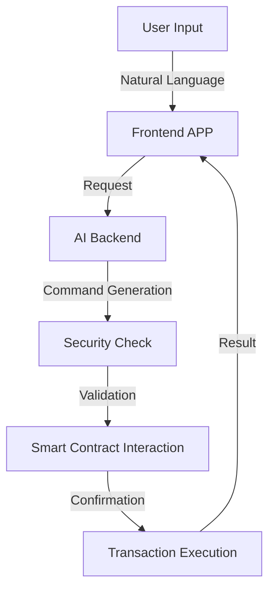

# EAM (Ethereum Agent Manager)

## Something about us

When I was young, I always dreamed to become a super hero that can change the world. And now, AI is the biggesr hero in the world.So we build Ethereum Agent Manager named EAM.We want to bring 10M Web2 users to Ethereum by simplifying interactions and enhancing security checks.We think it's not only a dream, it's a reality that can change the world.

## Overview

EAM is an innovative AI-powered middleware layer built between Ethereum and users, designed to revolutionize Web3 adoption. By leveraging advanced AI language capabilities, EAM aims to onboard the next 10M users into the Web3 ecosystem by making blockchain interactions intuitive and secure.EAM consists of three main components:

- Charlotte: Frontend Application built with Flutter for cross-platform compatibility, intuitive user interface, and natural language interactions.
- AI Backend: Developed with Python language, optimized for performance and security, and integrated with Charlotte.
- Middleware (Middleware): Designed to simplify on-chain operations and enhance user experience, providing a unified interface between users and Ethereum.

## Mission

Our mission is to bridge the gap between traditional users and Web3 technology by providing an intelligent, secure, and user-friendly interface that transforms natural language inputs into Ethereum operations.

## Architecture

EAM consists of three main components:

### 1. Charlotte

- Built with Flutter for cross-platform compatibility
- Intuitive user interface for natural language interactions
- Supports both text and voice inputs
- Real-time transaction preview and confirmation
- Wallet integration and management

### 2. AI Backend

- Advanced Natural Language Processing for understanding user intentions
- RAG (Retrieval-Augmented Generation) system for accurate command matching
- Smart command generation and optimization
- Standardized JSON output format for blockchain operations
- Multi-chain support and protocol adaptation

### 3. Security Check Model

- AI-powered smart contract risk assessment
- Real-time transaction analysis and validation
- Malicious contract detection
- Gas optimization recommendations
- User protection against common Web3 vulnerabilities

## Workflow

## Key Features

- **Natural Language Interface**: Interact with Ethereum using everyday language
- **Intelligent Command Generation**: Automatic conversion of user intentions into Ethereum operations
- **Security First**: Built-in security checks and risk assessment
- **Multi-Protocol Support**: Compatible with various DeFi protocols and Web3 applications
- **User-Friendly**: Simplified transaction flow with clear confirmations
- **AI-Powered Protection**: Advanced security measures to protect users from scams and errors

## Security

Security is at the core of EAM's design:

- AI-powered contract auditing
- Transaction simulation before execution
- Risk level assessment
- Suspicious activity detection
- Real-time security alerts

## Benefits

- **For Users**: Simplified Web3 interaction without technical knowledge
- **For Developers**: Easy integration with existing DApps
- **For the Ecosystem**: Accelerated Web3 adoption and improved security

## Technical Stack

- **Frontend**: Flutter
- **Backend**: Advanced AI Models
- **Blockchain**: Ethereum (with multi-chain expansion planned)
- **Security**: Custom AI security models
- **Infrastructure**: Distributed and scalable architecture

## Future Development

- Multi-chain support expansion
- Advanced AI model iterations
- Enhanced security features
- Community-driven development
- Integration with more DeFi protocols

## Contributing

We welcome contributions from the community! Please check our contribution guidelines for more information.

## License

This project is licensed under the MIT License - see the LICENSE file for details.
